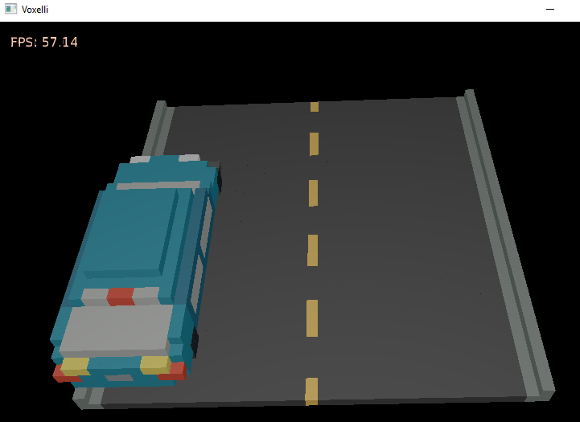

# Rust Experiments
This repository contains a series of experimental projects to learn more about the Rust programming language.

I'm no longer experimenting with this language -- there are more languages I feel that I'd like to explore and not sufficient advantages in this language, despite the hype around it. That's not to say that Rust is better or worse that C# or C++ -- you can accomplish the same tasks in both languages -- but I have no strong appeal for this language over other ones I have used.

## Rust Advantages
- Easy to get packages for all sorts of functionality.
- No GC penalty for operations.
- Very convenient structures, primitives, and general syntax.
- Lots of compile type checking for memory usage and typing.
- Very good VS Code editor support. 

## Rust Disadvantages
- Rust separates out each source file as its own module. This means you need a lot of boilerplate code to link files together and you tend to write larger (and harded to comprehend) files as a result. This is better than C++ header files, but much, much worse than C#.
- Build times are comparable to C++ or slower for small changes. 
- Same complexities with C++ with regards to Unicode string manipulation and package diamond dependency complexities.
- External code tends to make heavy use of macros to get around disadvantages, both large and small, which makes that code harder to understand.
- Manual memory management comes with a lot of developer-time overhead. 